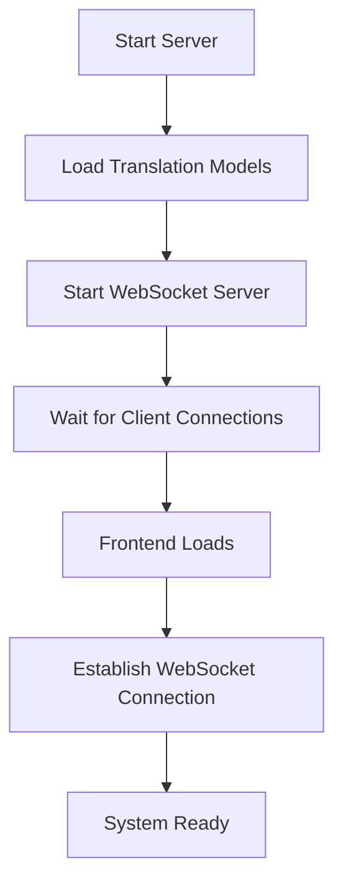

# Real-Time Bidirectional Translation System

A complete offline-capable translation system designed for travelers and local assistants to communicate seamlessly in real-time. The system supports bidirectional translation between English and multiple languages (Spanish, French, German, Italian, Portuguese) with role-based communication.

## 🎯 Project Idea

**Problem**: Travelers need to communicate with local assistants (hotel staff, tour guides, shop owners) who speak different languages, but language barriers prevent effective communication.

**Solution**: A real-time translation system where:

- **Travelers** speak in their native language and get responses translated back
- **Local assistants** receive translations in English and can respond naturally
- Both parties can switch roles as needed
- The system works completely offline once deployed

## 🏗️ Project Structure

```
realtime/
├── README.md                    # This comprehensive guide
├── PROJECT_STRUCTURE.md         # Detailed file organization
├── DEPLOYMENT.md               # Deployment instructions
├── requirements.txt            # Python dependencies
├── server.py                   # Main translation server
├── Dockerfile                  # Container configuration
├── docker-compose.yml          # Container orchestration
├── deploy.sh                   # Automated deployment script
├── nextjs-app/                 # Frontend React/Next.js application
│   ├── package.json
│   ├── next.config.js
│   ├── app/
│   │   ├── layout.tsx
│   │   ├── page.tsx            # Main UI component
│   │   └── globals.css
│   └── components/
└── utils/                      # Utility scripts
    ├── download_models.py      # Pre-download translation models
    └── test_offline.py         # Test offline functionality
```

## 🚀 Technologies Used

### Backend

- **Python 3.8+**: Core runtime
- **WebSockets**: Real-time bidirectional communication
- **Hugging Face Transformers**: Offline translation models
- **Helsinki-NLP opus-mt models**: High-quality translation models
- **PyTorch**: Machine learning inference
- **asyncio**: Asynchronous server handling

### Frontend

- **Next.js 14**: React framework
- **React 18**: UI library
- **TypeScript**: Type-safe development
- **Framer Motion**: Smooth animations
- **Web Speech API**: Browser-based speech recognition
- **WebSocket API**: Real-time server communication

### Deployment

- **Docker**: Containerization
- **Docker Compose**: Multi-service orchestration
- **systemd**: Linux service management
- **Bash scripts**: Automated deployment

## 🔄 Code Flow: Backend to Frontend

### 1. System Initialization



### 2. Translation Flow

#### Traveler Speaking (Foreign Language → English)

```
1. Traveler speaks in Spanish/French/German/Italian/Portuguese
2. Browser Speech Recognition captures audio → text
3. Frontend sends transcription via WebSocket to server
4. Server identifies client role as "traveler"
5. Server translates foreign language → English using opus-mt model
6. Server broadcasts English translation to all "assistant" clients
7. Assistant sees translated message in English
8. Server sends confirmation back to traveler
```

#### Assistant Responding (English → Foreign Language)

```
1. Assistant speaks in English
2. Browser Speech Recognition captures audio → text
3. Frontend sends transcription via WebSocket to server
4. Server identifies client role as "assistant"
5. Server translates English → traveler's language using opus-mt model
6. Server broadcasts translated message to all "traveler" clients
7. Traveler sees translated response in their language
8. Server sends confirmation back to assistant
```

### 3. Real-Time Features

- **Interim Transcription**: Shows speech-to-text results as user speaks
- **Role Switching**: Users can switch between traveler/assistant roles instantly
- **Session Management**: Multiple conversations can happen simultaneously
- **Offline Operation**: Works without internet once models are downloaded

## 🧠 Core Components Explained

### Backend: `server.py`

```python
class OfflineTranslator:
    # Manages bidirectional translation models
    # Loads Helsinki-NLP opus-mt models for offline use
    # Provides translate_to_english() and translate_from_english() methods

class TranslationServer:
    # WebSocket server handling client connections
    # Routes messages based on client roles (traveler/assistant)
    # Manages conversation sessions and broadcasting
```

**Key Methods:**

- `translate_traveler_to_assistant()`: Foreign language → English
- `translate_assistant_to_traveler()`: English → Foreign language
- `broadcast_to_assistants()`: Send messages to assistant clients
- `broadcast_to_travelers()`: Send messages to traveler clients

### Frontend: `nextjs-app/app/page.tsx`

```typescript
// Main UI component with role-based interface
const TranslationApp = () => {
  // State management for role, language, transcription
  const [currentRole, setCurrentRole] = useState<"traveler" | "assistant">(
    "traveler"
  );
  const [isRecording, setIsRecording] = useState(false);
  const [interimTranscript, setInterimTranscript] = useState("");

  // WebSocket connection for real-time communication
  // Speech Recognition setup for voice input
  // Role-specific UI rendering
};
```

**Key Features:**

- Role switcher with animated transitions
- Real-time speech recognition with interim results
- Conversation history with role-based message styling
- Language selection for travelers
- WebSocket message handling

## 🌐 Communication Protocol

### WebSocket Message Types

#### Client → Server

```json
{
  "type": "set_role",
  "role": "traveler|assistant",
  "session_id": "session_id",
  "language": "es|fr|de|it|pt"
}

{
  "type": "transcription",
  "text": "spoken text",
  "traveler_language": "es"
}

{
  "type": "start_recording",
  "language": "es"
}

{
  "type": "stop_recording"
}
```

#### Server → Client

```json
{
  "type": "traveler_message",
  "original": "Hola, necesito ayuda",
  "translated": "Hello, I need help",
  "traveler_language": "es",
  "timestamp": "14:30:15"
}

{
  "type": "assistant_response",
  "original": "How can I help you?",
  "translated": "¿Cómo puedo ayudarte?",
  "traveler_language": "es",
  "timestamp": "14:30:20"
}
```

## 🎨 User Interface Design

### Role-Based UI

- **Traveler Mode**: Blue theme, shows foreign language input and English translations
- **Assistant Mode**: Green theme, shows English input and foreign language translations
- **Role Switcher**: Animated toggle in header for instant role switching

### Real-Time Features

- **Interim Transcription**: Gray text showing speech recognition in progress
- **Final Transcription**: Bold text showing completed speech recognition
- **Message History**: Chat-like interface with timestamps and role indicators
- **Recording Indicator**: Visual feedback when microphone is active

## 🔧 Setup and Installation

### Prerequisites

- Python 3.8+
- Node.js 18+
- Docker (optional, for containerized deployment)

### Quick Start

1. **Clone and Setup**

   ```bash
   git clone <repository>
   cd realtime
   pip install -r requirements.txt
   ```

2. **Download Translation Models**

   ```bash
   python utils/download_models.py
   ```

3. **Start Backend**

   ```bash
   python server.py
   ```

4. **Start Frontend**

   ```bash
   cd nextjs-app
   npm install
   npm run dev
   ```

5. **Access Application**
   - Open browser: `http://localhost:3000`
   - WebSocket server: `ws://localhost:8765`

### Docker Deployment

```bash
# Build and run with pre-downloaded models
docker-compose up --build

# Or use automated deployment
./deploy.sh
```

## 🌍 Supported Languages

- **Spanish** (es) ↔ English
- **French** (fr) ↔ English
- **German** (de) ↔ English
- **Italian** (it) ↔ English
- **Portuguese** (pt) ↔ English

Models are bidirectional, supporting both directions for each language pair.

## 🔒 Offline Capabilities

The system is designed to work completely offline:

1. **Model Pre-downloading**: All translation models are downloaded during setup
2. **Local Model Loading**: Uses `local_files_only=True` to prevent internet requests
3. **Browser Speech Recognition**: Uses native browser APIs (works offline)
4. **Self-contained Deployment**: Docker container includes all dependencies

## 🛠️ Development Tips

### Adding New Languages

1. Add model configuration in `TRANSLATION_MODELS` dict in `server.py`
2. Download models using `utils/download_models.py`
3. Add language option in frontend language selector

### Customizing UI

- Edit `nextjs-app/app/page.tsx` for main interface
- Modify `nextjs-app/app/globals.css` for styling
- Adjust Framer Motion animations for different transitions

### Debugging

- Enable verbose logging in `server.py`
- Use browser developer tools for WebSocket inspection
- Test offline mode with `utils/test_offline.py`

## 📋 Common Use Cases

1. **Hotel Reception**: Traveler checking in, staff assisting
2. **Restaurant Orders**: Tourist ordering food, waiter taking order
3. **Shopping**: Customer asking about products, shop owner helping
4. **Tour Guidance**: Tourist asking questions, guide providing information
5. **Emergency Situations**: Quick communication in urgent scenarios

## 🤝 Contributing

1. Fork the repository
2. Create feature branch (`git checkout -b feature/new-feature`)
3. Test your changes with both roles
4. Ensure offline functionality works
5. Submit pull request with clear description

## 📄 License

[Add your license here]

## 🆘 Troubleshooting

### Common Issues

- **Models not loading**: Ensure models are downloaded with `utils/download_models.py`
- **WebSocket connection failed**: Check if server is running on port 8765
- **Speech recognition not working**: Ensure HTTPS or localhost (required by browser)
- **Translation errors**: Verify language codes match supported languages

### Getting Help

- Check `DEPLOYMENT.md` for detailed setup instructions
- Review logs in terminal for error messages
- Test with `utils/test_offline.py` for offline verification

---

**Ready to break down language barriers!** 🌍✨
